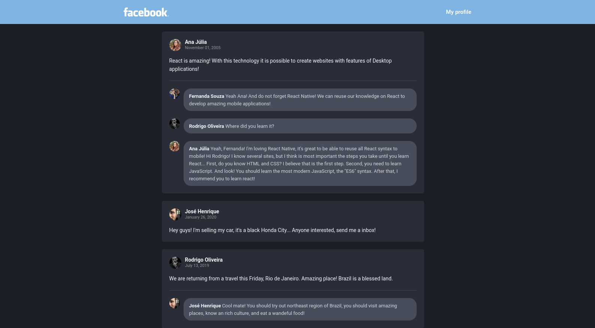

<h1 align="center">
    
</h1>

<h3 align="center">
  Desafio 4: Introdução ao React
</h3>

  

  

## :rocket: Sobre o desafio

Crie uma aplicação do zero utilizando **Webpack, Babel, Webpack Dev Server e ReactJS**.

Nessa aplicação você irá desenvolver uma **interface** semelhante com a do **Facebook** utilizando React.

As informações contidas na interface são **estáticas** e não precisam refletir nenhuma API REST ou back-end.

> Mais informações no [Repositório da Rocketseat](https://github.com/Rocketseat/bootcamp-gostack-desafio-04/).

### :computer: Tela da aplicação

Tela baseada no layout do Desafio, com a paleta de cores modificada!

## :memo: Licença

Esse projeto está sob a licença MIT. Veja o arquivo [LICENSE](LICENSE.md) para mais detalhes.

---
